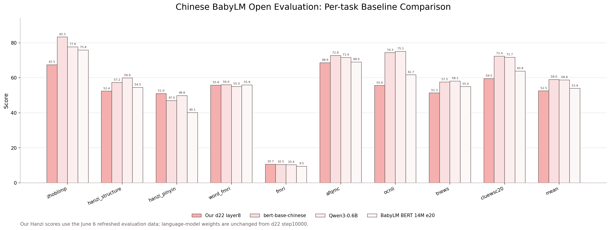

# Chinese BabyLM nanochat

This workspace adapts `karpathy/nanochat` for the NLPCC Chinese BabyLM task. It contains the recovered code, Chinese tokenizer/data preparation scripts, a trained d22 base checkpoint, and a base-model continuation CLI.

## Organizer Reproduction

For organizer-side reproduction from training data through final scores, use:

```bash
cd /mnt/proj/babyllm
bash scripts/reproduce_from_training.sh
```

Detailed instructions, expected artifacts, and final scores are documented in:

```text
docs/reproduce_from_training.md
```

The reproduction pipeline uses the official `chinese-babylm-org/babylm-zho-100M` corpus, trains the 32K tokenizer, trains the d22 base model from random initialization for 10,000 steps, exports the step-10000 checkpoint as HuggingFace `trust_remote_code` CausalLM with cognitive `representation_layer=8`, and runs the official final pipeline.

Current remote workspace:

```text
/mnt/proj/babyllm
```

Related data source:

```text
/mnt/proj/chinese-babylm
```

## Current Artifacts

Tokenizer:

```text
/mnt/proj/babyllm/chinese_cache/tokenizer/tokenizer.pkl
/mnt/proj/babyllm/chinese_cache/tokenizer/token_bytes.pt
```

Final base checkpoint:

```text
/mnt/proj/babyllm/chinese_cache/base_checkpoints/zh-d22-2gpu/model_010000.pt
/mnt/proj/babyllm/chinese_cache/base_checkpoints/zh-d22-2gpu/meta_010000.json
```

Loss curve:

```text
/mnt/proj/babyllm/docs/zh_d22_recovered_loss_curve.png
/mnt/proj/babyllm/docs/zh_d22_recovered_loss_curve.csv
```

Training log:

```text
/mnt/proj/babyllm/runs/logs/base_train_zh_d22_1gpu_recovered_20260527_181434.log
```

## Environment

Activate the restored environment:

```bash
cd /mnt/proj/babyllm
. .venv/bin/activate
```

Common environment variables:

```bash
export HF_ENDPOINT=https://hf-mirror.com
export NANOCHAT_BASE_DIR=/mnt/proj/babyllm/chinese_cache
export NANOCHAT_DTYPE=bfloat16
export NANOCHAT_DISABLE_EXPANDABLE_SEGMENTS=1
export NANOCHAT_DISABLE_COMPILE=1
```

If the environment is missing after container reset:

```bash
cd /mnt/proj/babyllm
bash runs/setup_recovered_env.sh
```

## Data Preparation

The Chinese BabyLM dataset is linked here:

```text
/mnt/proj/babyllm/data/babylm-zho-100M
```

Prepare nanochat parquet shards:

```bash
cd /mnt/proj/babyllm
. .venv/bin/activate

export NANOCHAT_BASE_DIR=/mnt/proj/babyllm/chinese_cache

python scripts/prepare_chinese_babylm.py \
  --data-dir data/babylm-zho-100M \
  --base-dir "$NANOCHAT_BASE_DIR" \
  --num-train-shards 16 \
  --val-fraction 0.005 \
  --overwrite
```

Latest prepared split:

```text
train rows: 182,680
val rows: 918
shards: 17
```

## Tokenizer

Train the 32K Chinese tokenizer:

```bash
cd /mnt/proj/babyllm
. .venv/bin/activate

export NANOCHAT_BASE_DIR=/mnt/proj/babyllm/chinese_cache

python -m nanochat.report reset
python -m scripts.tok_train \
  --vocab-size 32768 \
  --max-chars 200000000 \
  --doc-cap 10000
```

Evaluate tokenizer compression:

```bash
python -m scripts.tok_eval
```

Latest tokenizer evaluation:

| Split | Ours ratio | GPT-2 ratio | GPT-4 ratio |
| --- | ---: | ---: | ---: |
| train | 4.98 | 1.43 | 2.20 |
| val | 4.81 | 1.44 | 2.19 |

## Base Model Training

The recovered final run was a d22 base model:

```text
depth: 22
params: 1.123B
sequence length: 1024
vocab size: 32768
trained tokens: 655,360,000
final step: 10000
```

The successful run used one RTX 5090. Two-card DDP under the current HAMI/NCCL environment repeatedly stalled before the first training step, so the final recovered checkpoint is from a single-GPU run.

Command used:

```bash
cd /mnt/proj/babyllm
. .venv/bin/activate

export HF_ENDPOINT=https://hf-mirror.com
export NANOCHAT_BASE_DIR=/mnt/proj/babyllm/chinese_cache
export NANOCHAT_DTYPE=bfloat16
export NANOCHAT_DISABLE_EXPANDABLE_SEGMENTS=1
export NANOCHAT_DISABLE_COMPILE=1
export PYTHONUNBUFFERED=1
export OMP_NUM_THREADS=1
export CUDA_VISIBLE_DEVICES=0
export WANDB_MODE=disabled

python -m scripts.base_train \
  --depth 22 \
  --head-dim 64 \
  --window-pattern L \
  --max-seq-len 1024 \
  --device-batch-size 4 \
  --total-batch-size 65536 \
  --eval-every -1 \
  --core-metric-every -1 \
  --sample-every -1 \
  --save-every 1000 \
  --num-iterations 10000 \
  --run dummy \
  --model-tag zh-d22-2gpu
```

Final training stats:

```text
final train loss: 0.015389
min train loss: 0.014984
total training time: 363.75 minutes
peak memory: ~19.1 GiB
```

Generate a loss curve from the log:

```bash
cd /mnt/proj/babyllm
. .venv/bin/activate

python - <<'PY'
import re
from pathlib import Path
import matplotlib.pyplot as plt

log = Path("runs/logs/base_train_zh_d22_1gpu_recovered_20260527_181434.log")
out = Path("docs/zh_d22_recovered_loss_curve.png")
pat = re.compile(r"step\s+(\d+)/(\d+).*?loss:\s+([0-9.]+)")
steps, losses = [], []
for line in log.read_text(errors="ignore").splitlines():
    m = pat.search(line)
    if m:
        steps.append(int(m.group(1)))
        losses.append(float(m.group(3)))

plt.figure(figsize=(12, 6), dpi=160)
plt.plot(steps, losses)
plt.title("Chinese BabyLM d22 Base Training Loss")
plt.xlabel("Step")
plt.ylabel("Training loss")
plt.grid(True, alpha=0.3)
plt.savefig(out, bbox_inches="tight")
print(out)
PY
```

## Base Model CLI

Use `scripts/base_cli.py` for base-model continuation. Do not use `scripts/chat_cli.py` for the base model, because `chat_cli.py` inserts chat tokens such as `<|user_start|>` and `<|assistant_start|>`.

One-shot continuation:

```bash
cd /mnt/proj/babyllm
. .venv/bin/activate

CUDA_VISIBLE_DEVICES=0 \
NANOCHAT_BASE_DIR=/mnt/proj/babyllm/chinese_cache \
NANOCHAT_DTYPE=bfloat16 \
NANOCHAT_DISABLE_EXPANDABLE_SEGMENTS=1 \
NANOCHAT_DISABLE_COMPILE=1 \
python -m scripts.base_cli \
  --model-tag zh-d22-2gpu \
  --step 10000 \
  --prompt "孙悟空" \
  --max-tokens 120 \
  --temperature 0.8 \
  --top-k 50 \
  --device-type cuda
```

Interactive continuation:

```bash
CUDA_VISIBLE_DEVICES=0 \
NANOCHAT_BASE_DIR=/mnt/proj/babyllm/chinese_cache \
NANOCHAT_DTYPE=bfloat16 \
NANOCHAT_DISABLE_EXPANDABLE_SEGMENTS=1 \
NANOCHAT_DISABLE_COMPILE=1 \
python -m scripts.base_cli \
  --model-tag zh-d22-2gpu \
  --step 10000 \
  --device-type cuda
```

The CLI prints the prompt and the actual model input, including special tokens:

```text
Prompt: 孙悟空
----------------------------------------------------------------------------------------------------
<|bos|>孙悟空找工作
...
```

This is a base model, so it continues text. It is not an instruction/chat model.

## Evaluation

Official Chinese BabyLM eval pipeline path:

```text
/mnt/proj/chinese-babylm-eval-pipeline
```

Recovered nanochat eval configs:

```text
/mnt/proj/babyllm/eval_configs/nanochat_zh_d22_full_eval.yaml
/mnt/proj/babyllm/eval_configs/nanochat_zh_d22_official_eval.yaml
```

Previous official-style result before the container reset was documented in:

```text
/mnt/proj/babyllm/docs/chinese_babylm_eval_todo.md
```

If re-running eval, update `NANOCHAT_BASE_DIR`, `NANOCHAT_MODEL_TAG`, and `NANOCHAT_MODEL_STEP` for the current checkpoint:

```bash
export HF_ENDPOINT=https://hf-mirror.com
export NANOCHAT_REPO=/mnt/proj/babyllm
export NANOCHAT_BASE_DIR=/mnt/proj/babyllm/chinese_cache
export NANOCHAT_DTYPE=bfloat16
export NANOCHAT_DISABLE_EXPANDABLE_SEGMENTS=1
export NANOCHAT_DISABLE_COMPILE=1
export NANOCHAT_MODEL_TAG=zh-d22-2gpu
export NANOCHAT_MODEL_STEP=10000
```

### Baseline Comparison

The final step-10000 HF export was evaluated with a fresh, unmodified copy of the official Chinese BabyLM eval pipeline using the standard `backend: causal` path. The Hanzi tasks use the refreshed June 6 evaluation data/rules released by the organizers. For cognitive tasks, the submitted HF config exposes layer 8 as the `AutoModel` representation (`representation_layer=8`, `representation_hidden_states_mode=selected_only`), which improved the open cognitive scores without changing the language-model weights. The figure below compares our model with three representative baselines:

- `bert-base-chinese`: strongest mean score among the listed baseline table.
- `Qwen3-0.6B`: strong generative baseline.
- `babylm-chinese-bert-14m-epoch20`: strong small BabyLM-trained baseline.

Our model is highlighted in pink. The other baselines use progressively lighter comparison colors.
Our Hanzi scores use the June 6 refreshed evaluation data; baseline values are the public reference scores listed in the challenge materials available during development.



Final official scores for `zh-d22-step10000`:

| Model | zhoblimp | hanzi_structure | hanzi_pinyin | word_fmri | fmri | afqmc | ocnli | tnews | cluewsc2020 | mean |
| --- | ---: | ---: | ---: | ---: | ---: | ---: | ---: | ---: | ---: | ---: |
| `zh-d22-step10000-layer08-selected` | 67.45 | 52.35 | 51.00 | 55.80 | 10.66 | 68.61 | 55.59 | 51.31 | 59.54 | 52.48 |

The model is competitive with several BabyLM-scale baselines, but remains below strong pretrained baselines such as `bert-base-chinese` and `Qwen3-0.6B`, especially on `zhoblimp`, `ocnli`, and `cluewsc2020`. This is expected for a base continuation model trained only on the Chinese BabyLM corpus without instruction tuning or additional large-scale pretraining.

## Notes

- The model tag `zh-d22-2gpu` is kept for compatibility with earlier scripts, even though the recovered final run used one GPU.
- `chat_cli.py` is for SFT/RL chat checkpoints. Use `base_cli.py` for base checkpoints.
- The final loss is very low because the model is large relative to the dataset and trained for many epochs. Treat CLI output as continuation behavior, not instruction following.
- To create a real assistant, continue with SFT from the base checkpoint.
